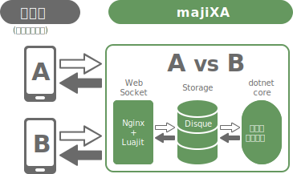

<center></center>

# MajiXA

リアルタイム通信パッケージ for Unity

---

## 概要

**MajiXA**は、リアルタイム通信ゲームを開発することが出来るパッケージです。  
[nginx-luajit-ws](https://github.com/sassembla/nginx-luajit-ws)をベースにUnity上で開発をしやすくしたものです。  
言語はC#です。

### 仕組み


---
## 動作確認環境
### クライアント
- Unity 2017以降
### サーバ
- CentOS 7
- Ubuntu

---
## クライアントのセットアップ

1. Unity上で新規プロジェクトを作成します
2. MajiXA_1.0.0.unitypackageをImportします
3. [WebuSocket](https://github.com/sassembla/WebuSocket/archive/master.zip)をダウンロードして解凍します。
4. WebuSocket-master/WebuSocketフォルダを、1.で作ったプロジェクトのAssets/MajiXA/Client/以下にコピーします。
5. [Disquuun](https://github.com/sassembla/Disquuun/archive/master.zip)をダウンロードして解凍します。
6. Disquuun-master/Disquuunフォルダを、1.で作ったプロジェクトのAssets/MajiXA/Server/Editor/以下にコピーします。

---
## 動作確認

サンプルを使って動作確認をします。

1. MajiXA_Sample.unitypackageをImportします
2. Assets/Sample/からSampleシーンを開きます。
3. MajiXA/Configs/のConfig.csのBUNDLE_IDENTIFIERをユニークなバンドルIDに書き換えます。

これでサンプルの準備は完了です。  
以下から動作確認をします。

5. Unityから再生します。
6. メニューからMajiXA > Local Server Controller を選択してウィンドウを表示します。
7. LocalServerCtrl(以後LSC)の「Start」ボタンを押します。接続プレイヤー数とルーム数が表示されます。
8. Game画面内の「Connect to Server」ボタンを押します。
9. *LSCの接続プレイヤー数が1になったことを確認します。*
10. Game画面内の「Room Join」ボタンを押します。
11. *LSCのルーム数が1になったことを確認します。*
12. Game画面内の「ResponseNumber」ボタンを押します。
13. *Game画面内に「Get Number XX(ランダムな数字)」が表示されることを確認します。*
14. Game画面内の「Room Leave」ボタンを押します。
15. *LSCのルーム数が0になったことを確認します。*
16. Game画面内の「Disconnect」ボタンを押します。
17. *LSCの接続プレイヤー数が0になったことを確認します。*
18. Unityの再生を終了します。

この一連の流れが動作すれば正しく動いています。

---
## サーバ側のセットアップ

ここではLinuxサーバ（centos or ubuntu）を使用します。

1. Linuxサーバを構築します。
2. dockerをインストールします。 `yum install docker`
3. dockerを起動 `systemctl start docker`
4. [nginx-luajit-ws](https://github.com/sassembla/nginx-luajit-ws/archive/benchmark-with-netcore.zip)をダウンロードして解凍します。
5. cd nginx-luajit-ws-benchmark-with-netcore
6. DockerResources/nginx.confの62行目、63行目の`sample_disque_client`を`disque_client`に書き換えます。(sample_を削除する) 
7. DockerResources/lua/sample_disque_client.luaのファイル名をdisque_client.luaに書き換えます。
7. nginx-luajit-ws-benchmark-with-netcore/c_rebuild.shを実行します。
8. `docker ps`でnginx_luajitが起動していれば成功です。

## Dotnetのセットアップ

サーバ側のプログラムを配置します。

1. DotNet Coreおよびdotnet-sdkをインストールします。
2. サーバプログラムに必要なプログラムを配置します。
　　Program.cs
　　majixa.csproj
　　Assets/MajiXA/ClientAndServer/*
　　Assets/MajiXA/Configs/Editor/*
　　Assets/MajiXA/Server/Editor/*
　　その他プロジェクトで追加したサーバ側プログラム
3. ビルド `dotnet build`
4. 実行 `dotnet run`

---
## 設定
MajiXA内の設定ファイルをいくつか修正する必要があります。
- MajiXA/ClientAndServer/Commands.cs  
    - ProcessingNameSpace  
サーバ側の処理(IProcessingを継承したクラス)でnamespaceを使用する際はそのnamespaceを記述
    - eCom  
各種コマンドを設定
- MajiXA/Configs/Editor/Server.cs
    - DISQUE_HOST_IP
    - DISQUE_PORT  
    接続先DisqueのIPとポートを設定します。  
---
## 使い方（クライアント側）

### サーバに接続する
IPアドレスとポートを指定します。  
Config.Common.BUNDLE_IDENTIFIERを、ユニークな文字列になるように変更する必要があります。
```cs
using MajiXA;

void Start()
{
	WebuSocketController ws = new WebuSocketController();
	ws.Connect("111.222.333.444:8080", Config.Common.BUNDLE_IDENTIFIER);
}
```
### 切断する
```cs
ws.Close();
```

### データを送信する
クライアントからサーバに対してデータを送信する方法  
最初の1byte目には、必ずCommands.eComに設定した値を入れる必要があります。
```cs
// 例えばXXXというコマンド（コマンドはMajiXA/ClientAndServer/Commands.csに記述）でfooというintを送りたい時
int foo = 1;
List<byte> data = new List<byte>();
data.Add((byte)Commands.eCom.XXX);
data.AddRange(foo.ToBytes());
ws.Send(data.ToArray());

// これでコマンドが1byte、fooがintなので4byte、計5byteのデータを送信します。
```

### データを受け取る
byte配列を引数に持つ ReceiveXXX（名前は任意） を作成して、receiveActionDictに登録します。  
こうしておく事でサーバからCommands.eCom.XXXのコマンドでデータが届いた場合、ReceiveXXXが呼ばれます。
```cs
void Start()
{
    ws.receiveActionDict.Add((byte)Commands.eCom.XXX, ReceiveXXX);
}

void ReceiveXXX(byte[] ret)
{
    ...
}
```
---
## 使い方（サーバ側）

### IRoomを継承したclassを用意する
- OnUpdate()は毎ループ呼ばれます。
- Joinは、このRoomに入室する際に呼びます。
- Leaveは、このRoomから退室する際に呼びます。
### Commands.eComに設定されているコマンドと同名のclassを用意する。その際、IProcessingを継承する。
- OnMessageはclass名のコマンドがクライアントから送信されてきた際に呼ばれます。


---
## ライセンス

MIT
